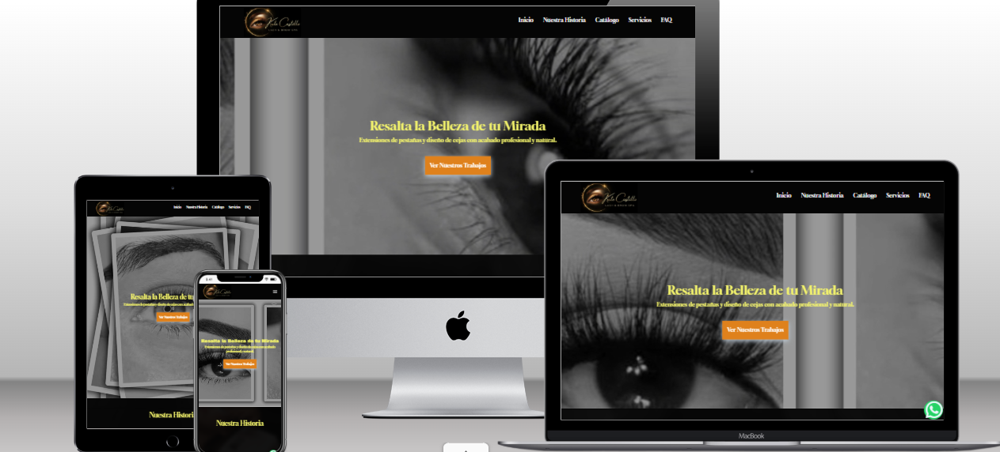

🚀 Project: Digital Ecosystem - Kate Lash & Brow Spa

## 📋 Description
This project involved the design, development, and comprehensive technical deployment for **Kate Lash & Brow Spa**, located in Cartagena, Spain. The primary goal was to establish a professional digital presence, optimized for local SEO with advanced analytical tools.

**Live Site:** [https://katelashbeauty.com/](https://katelashbeauty.com/)

## 🛠️ Tech Stack
* **Frontend:** HTML5, CSS3 (Optimized and Minified), JavaScript (ES6+).
* **Hosting & Domain:** Namecheap (Stellar Plan).
* **Security:** SSL Certificate (HTTPS) configured.
* **Google Tools:**
    * Google Search Console (Indexing and Monitoring).
    * Google Analytics 4 (GA4) (Audience Measurement).
    * Google Business Profile (Local SEO and Google Maps).

## ⚙️ Technical Implementation
### 1. Development and Deployment
* Clean and optimized file structure for fast loading speeds.
* Developed using **Visual Studio Code**.
* Deployed via **cPanel File Manager** in the `public_html` directory.

### 2. Technical SEO
* **Sitemap.xml:** Generated and submitted the site map to facilitate crawling.
* **Robots.txt:** Configured directives for search bots and optimized the crawl budget.
* **Favicon:** Implemented a custom icon (`gemfav1.png`) for brand identity in tabs and search results.

### 3. Analytics and Conversion
* Integrated the `gtag.js` script for real-time tracking.
* Implemented a **floating WhatsApp button** to drive conversion from visitors to actual clients.

## 📍 Local SEO
* Full profile configuration on Google Maps for the physical location at **Calle Diamante 13, Cartagena**.
* Keyword optimization for eyelash and beauty services in the Murcia region.

## 👤 Author
**Roger Smit Castillo**
* Technical Support Specialist & Front-End Developer.
* Expert in SaaS solution deployment and web support.

---
*This project represents a 360° deployment from source code to final search engine indexing.*